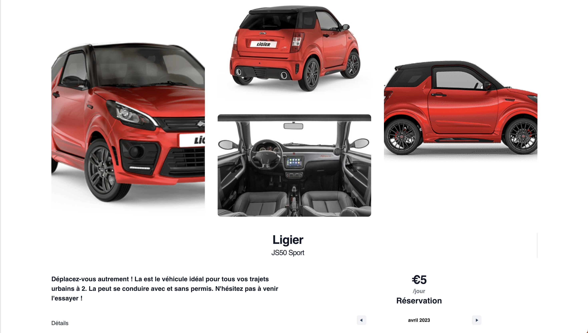

<br/>
<p align="center">
  <a href="https://github.com/Jesuisleon/WCS-Elite-Fleet">
    
  </a>

  <h3 align="center">HACKATON WCS Elite Fleet</h3>

  <p align="center">
    Our team of 5 developers created a luxury car-sharing service for non-driving vehicles using React in the front-end, Node.js Express in the back-end, and SQLite for the database. We offer a smooth user experience and optimal data management.
    <br/>
    <br/>
    <a href="https://wcs-elite-fleet.vercel.app/">View Demo</a>
  </p>
</p>


## Table Of Contents

* [About the Project](#about-the-project)
* [Built With](#built-with)
* [Getting Started](#getting-started)
* [Installation](#installation)
* [Authors](#authors)

## About The Project



This project was developed during a national hackathon at the Wild Code School, where the development team was tasked with creating a vehicle fleet management application with multiple levels of users. Using modern technologies such as React, Tailwind, Vite, Express, Node.js, and MySQL, the team managed to develop a performant and user-friendly application that allows users to rent luxury vehicles without a driving license, for a day or for a longer period.

The team decided to switch from MySQL to SQLite for the database in order to provide a more lightweight and faster option for the demo. This project offers users a luxury rental experience, allowing them to rent high-end vehicles without the need for a driving license. The user interface is user-friendly and easy to use, with features such as online booking and user account management.

This repo is intended for developers who want to explore the technologies used in the development of this application, as well as for users who want to rent luxury vehicles without a driving license. We hope this project will be useful to you and we welcome any suggestions or contributions to improve this application.

Feel free to clone this repo and use it for your own projects. We hope you enjoy using this application as much as we enjoyed developing it.

Thank you for your interest and support.

Best regards,

## Built With

* [Vite](https://vitejs.dev/)
* [ESLint](https://eslint.org/)
* [Prettier](https://prettier.io/)
* [Nodemon](https://nodemon.io/)
* [React](https://fr.reactjs.org/)
* [Express](https://expressjs.com/fr/)
* [Tailwind](https://tailwindcss.com/)
* [Headless UI](https://headlessui.com/)
* [SQLite](https://sqlite.org/index.html)

## Getting Started
Welcome to the luxury vehicle rental site! This application has two levels of users: administrators and regular users. Administrators can view the information of other users, while regular users can rent vehicles.

To use this application as a regular user, simply follow these steps:

1. Register for an account: Click on the "Register" button and enter your information to create a user account.

2. Browse available vehicles: Once you have created an account, you can browse the available vehicles on the site.

3. Select a vehicle: Once you have found a vehicle you would like to rent, click on the vehicle to view more information about it.

4 . Make a reservation: If you would like to rent the vehicle, select the dates you would like to reserve it for and click on the "Reserve" button.

5. Confirm your reservation: Once you have made a reservation, an administrator will review it and confirm it.

6. Pick up your vehicle: On the day of your reservation, you can pick up your vehicle at the designated location and enjoy your luxury rental!


To use this application as an administrator, simply follow these steps:

1. Login as an administrator: Click on the "Admin" button and enter your administrator login credentials.

2. View user information: Once you have logged in as an administrator, you can view the information of other users.

We hope this guide helps you navigate the luxury vehicle rental site. If you have any questions or issues, please don't hesitate to contact us.

Best regards,hope you find our platform helpful and easy to use. If you have any questions or concerns, please do not hesitate to contact us for support.

Admin email : root@root.com
Admin password : ben

User email : ben@wcs.com 
User password : ben

Enjoy

### Available Commands

- `setup` : Initialization of frontend and backend, as well as all toolings
- `migrate` : Run the database migration script
- `dev` : Starts both servers (frontend + backend) in one terminal
- `dev-front` : Starts the React frontend server
- `dev-back` : Starts the Express backend server
- `lint` : Runs validation tools, and refuses unclean code (will be executed on every _commit_)
- `fix` : Fixes linter errors (run it if `lint` growls on your code !)

To get a local copy up and running follow these simple example steps.

### Installation

1. Clone the repo

```sh
 Clone this repo, enter it
```

2. Install NPM packages

```sh
Run command `pnpm run setup`
```

3. Create a SQL database

4. Create a SMTP account
https://www.sendinblue.com/

5. Create your backend .env file with theses keys
```backend .env file
APP_PORT=
FRONTEND_URL=
DB_HOST=
DB_PORT=
DB_USER=
DB_PASSWORD=
DB_NAME=
JWT_SECRET=Tintin
SMTP_SENDIN=
SMTP_PORT_SENDIN=
SMTP_SENDIN_USER=
SMTP_SENDIN_PASSWORD=
```

6. Create your frontend .env file with this key
```frontend .env file
VITE_BACKEND_URL=
```

7. Run Migrate with this command
```sh
Run command `node migrate.js` on the backend folder
```

## Authors
* **Charline Vergoz** - [Charline](https://github.com/CV418)
* **Benoit Bonnoron** - [Ben](https://github.com/BenBonno)
* **Lucas Fasilleau** - [Lucas](https://github.com/madashii)
* **Laurent Duclos** - [Laurent](https://github.com/ldc911)
* **Léon Versavel** - [Léon](https://github.com/Jesuisleon)


